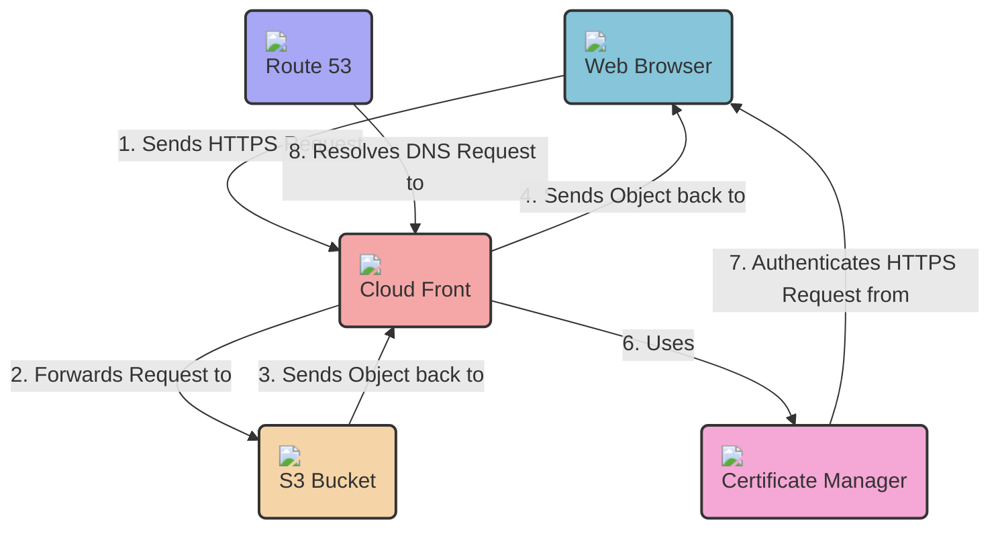

# sandclock-productivity-app
React WebApp for Productivity

```mermaid
graph TD;
    A(<img align='center' src='https://cdn.icon-icons.com/icons2/2031/PNG/512/internet_browser_icon_124066.png' width='50' />  <div>Web Browser<br></div>):::styleKlasse-->|1. Sends HTTPS Request| B(<img align='center' src='https://cdn2.iconfinder.com/data/icons/amazon-aws-stencils/100/Storage__Content_Delivery_Amazon_CloudFront-512.png' width='80' />  <div>Cloud Front<br></div>);
    B:::styleKlasse -->|2. Forwards Request to| C(<img align='center' src='https://cdn2.iconfinder.com/data/icons/amazon-aws-stencils/100/Storage__Content_Delivery_Amazon_S3_Bucket-512.png' width='80' /> <div>S3 Bucket<br></div>);
    C:::styleKlasse-->|3. Sends Object back to| B;
    B:::styleKlasse-->|4. Sends Object back to| A;
    B:::styleKlasse -->|6. Uses| E(<img align='center' src='https://symbols.getvecta.com/stencil_23/3_aws-certificate-manager.6f8e5390b5.svg' width='60' />  <div>Certificate Manager<br></div>):::styleKlasse-->|7. Authenticates HTTPS Request from| A;
    F(<img align='center' src='https://cdn2.iconfinder.com/data/icons/amazon-aws-stencils/100/Compute__Networking_copy_Amazon_Route_53_Hosted_Zone-512.png' width='80' />  <div>Route 53<br></div>):::styleKlasse-->|8. Resolves DNS Request to| B;

    %% Styling
    classDef styleKlasse stroke:#333,stroke-width:2px, align-items:center, justify-content:center;
    %%style A, B, C, E, F fill:#fff,stroke:#333,stroke-width:2px; 
    %%style A, B, C, E, F text-align:center;
    style A fill:#86C5DA;
    style B fill:#F5A7A7;
    style C fill:#F5D5A7;
    style E fill:#F5A7D5;
    style F fill:#A7A7F5;
```
